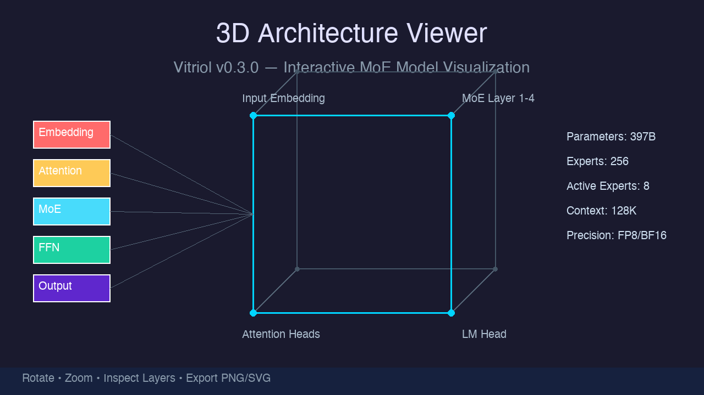

<p align="center">
  <h1 align="center">Vitriol</h1>
  <p align="center"><strong>LLM Architecture Exploration, Visualization & Neural Architecture Search Platform</strong></p>
</p>

<p align="center">
  
  
  
  
  
  
</p>

<p align="center">
  <a href="README.md">English</a> · <a href="README_CN.md">中文</a>
</p>

---

Vitriol is a toolkit for researching and maintaining LLM architectures. It decouples **structure** from **weights**, letting you explore, visualize, and optimize model architectures at MB-level cost without downloading GB-scale real weights.

## Core Capabilities

| Capability | Description |
|-----------|-------------|
| **Minimal Weight Generation** | 13 strategies to compress GB-scale models to MB/KB level, fully `transformers` compatible |
| **Architecture Visualization** | Interactive HTML + 3D browser-first viewer with 10 specialized analyzers |
| **Neural Architecture Search** | LLM-focused NAS with Random, Evolutionary, Targeted, and RL-based algorithms |
| **Architecture Evolution** | Family trees, smart comparison, performance simulation, innovation timeline |
| **Compression Intelligence** | Multi-dimensional evaluation framework (CIS) for compression strategies |
| **Quantized Inference** | TurboQuant KV cache compression, Triton-accelerated kernels, PPL evaluation |
| **Web UI & REST API** | Gradio-based GUI + optional FastAPI server for programmatic access |

## Highlights

- **GB → MB compression**: 13 strategies from Random to Ultra (stride=0 hack, 1 float for any tensor)
- **Zero-memory instantiation**: Build 397B parameter skeletons on 8GB RAM via PyTorch Meta Device
- **12 weight generation strategies + 1 hybrid**: Random, Compact, Ultra, Sparse, StructuredSparse, Ternary, Binary, Quantized, LowRank, Learned, HybridLearned, HybridUltra, Quantum
- **10 architecture analyzers**: Auto-detect GQA/MQA/MLA, RoPE, MoE (Shared+Routed Expert), multimodal components — including Qwen3.5 MoE with Linear/Full attention layer detection
- **4 NAS algorithms**: Random Search, Evolutionary (GA), Targeted (constraint + multi-objective optimization), Reinforcement Learning agent
- **Plugin adapter system**: Auto-discovery registry for extending to new model families
- **18 CLI commands**: Complete toolchain from generation to benchmarking and inference
- **Web UI**: Gradio interface with evolution tree, comparison, simulation, and targeted NAS
- **REST API**: Experimental FastAPI server for HTTP-based model generation and search
- **Triton GPU acceleration**: FWHT, blockwise min-max quantization, bit-packing kernels for KV cache compression
- **PPL evaluation framework**: Real perplexity metrics replacing proxy measures for quantized inference validation

## Design Philosophy: Structure–Data Decoupling

The central insight behind Vitriol is that **model performance is a confound of structure and data**. As new models flood leaderboards daily, it becomes increasingly difficult to answer a fundamental question:

> *Is the improvement due to a better architecture, or more data, better training recipes, or simply longer training?*

Vitriol answers this by **completely separating the structural skeleton from trained weights**:

```
┌─────────────────┐       ┌──────────────────────┐       ┌──────────────────┐
│   Structure      │       │   Bridge              │       │   Data           │
│   Layer          │──────►│   init_empty_weights() │──────►│   generate_      │
│                  │       │   from_config()        │       │   tensor(        │
│  config.json     │       │                        │       │     shape,       │
│  (KB only)       │       │  param.shape ◄────────┼───────│     dtype,       │
│                  │       │  param.dtype ◄────────┼───────│     name)        │
│  hidden_size     │       │  named_parameters()   │       │                  │
│  num_layers      │       │                        │       │  13 strategies   │
│  num_heads       │       │  No GPU, no weight     │       │  Pure algorithm  │
│  model_type      │       │  download required     │       │  No training     │
└─────────────────┘       └──────────────────────┘       └──────────────────┘
```

**Three-phase decoupled pipeline:**

| Phase | What happens | Input | Output |
|-------|-------------|-------|--------|
| **1. Config → Structure** | Parse `config.json` (download ~KB) | HuggingFace model ID | `PretrainedConfig` with all architectural attributes |
| **2. Structure → Skeleton** | Build model with `from_config()` inside `init_empty_weights()` | `PretrainedConfig` | Empty model with exact `(shape, dtype, name)` for every parameter — **zero memory allocated** |
| **3. Skeleton → Weights** | Fill each parameter via strategy's `generate_tensor(shape, dtype, name)` | `(shape, dtype, name)` triple | Structurally compatible weight files |

**Why this matters for research:**

- **Architecture ablation at zero cost**: Compare LLaMA-70B vs Qwen-72B architecture differences without downloading 140 GB of weights. A 70B model skeleton is built in ~5 seconds on CPU.
- **Isolate structural contributions**: By generating *structurally identical* weights across models (e.g., all using `random` strategy), you can benchmark whether a performance gap comes from architecture or training.
- **CI/CD without GPUs**: Run `transformers` loading, sharding validation, and architecture analysis in pure CPU environments — no GPU, no 100 GB disk space.
- **NAS on real topology**: Neural Architecture Search operates on actual model configs (not simplified proxies), discovering architectures that `from_config()` can instantiate.
- **Fair benchmarking**: Generate `random`-initialized models of identical architecture but different reported sizes, revealing whether claimed "scaling laws" are structural or training artifacts.

```python
# Example: Isolate architecture from data
# Same structure, different "data" — purely algorithmic
python -m vitriol.cli.main generate Qwen/Qwen2.5-72B --strategy random    # Full-size, real distribution
python -m vitriol.cli.main generate Qwen/Qwen2.5-72B --strategy compact   # Same shape, zero-filled
python -m vitriol.cli.main generate Qwen/Qwen2.5-72B --strategy ultra     # Same shape, 1-float stride=0

# All three produce structurally identical models (same param names, shapes, dtypes)
# Only the "data" filling strategy differs — enabling controlled ablation
```

## Quick Start

### Installation

```bash
git clone https://github.com/isLinXu/Vitriol.git
cd Vitriol

pip install -e .
# Dev dependencies (tests/lint/typecheck)
pip install -e ".[dev]"
# Web UI
pip install -e ".[webui]"
# REST API (experimental)
pip install -e ".[api]"
```

### Common Tasks

```bash
# Generate minimal weights
python -m vitriol.cli.main generate Qwen/Qwen2.5-0.5B -o output/qwen-mini

# Ultra compression (smallest possible)
python -m vitriol.cli.main generate Qwen/Qwen2.5-0.5B -o output/qwen-ultra --strategy ultra

# Visualize architecture (interactive HTML)
python -m vitriol.cli.main arch-viz Qwen/Qwen2.5-0.5B --html -o output/qwen_viz.html

# 3D model viewer
python -m vitriol.cli.main viz Qwen/Qwen2.5-0.5B --3d

# Neural Architecture Search
python -m vitriol.cli.main nas --algorithm evolutionary --generations 10 --population 20

# Architecture evolution tree
python -m vitriol.cli.main evolve tree -o output/evolution_tree.html

# Compare two architectures
python -m vitriol.cli.main evolve compare Qwen/Qwen2.5-7B DeepSeek-V3/DeepSeek-V3

# Performance simulation
python -m vitriol.cli.main evolve simulate Qwen/Qwen2.5-72B --gpu H100

# Launch Web UI
python -m vitriol.cli.main webui
```

## CLI Reference

 Vitriol provides **18 commands** via:

```bash
python -m vitriol.cli.main <command> [options]
# or
vitriol <command> [options]
```

| Command | Description |
|---------|-------------|
| `generate` | Generate minimal weights for a model |
| `validate` | Validate a generated model (load, tokenizer, inference) |
| `analyze` | Analyze model architecture (layers, params, attention type) |
| `batch` | Generate multiple models from YAML config |
| `bench` | KV Cache compression benchmarking suite (6 sub-commands) |
| `export` | Export a generated model |
| `visualize` | Generate weight visualization report |
| `viz` | Launch interactive model visualizer (3D) |
| `arch-viz` | Visualize architecture topology from config |
| `nas` | Neural Architecture Search |
| `vocab-viz` | Visualize tokenizer vocabulary in 3D |
| `weight-viz` | Visualize model weights in 3D |
| `evolve` | Architecture evolution tools (tree, compare, simulate, families, timeline, recommend) |
| `exobrain` | External brain inference and distillation experiments |
| `hash` | Compute model hash fingerprints |
| `infer` | Run single-prompt inference with TurboQuant presets |
| `trace` | Generate an offline trace.json for replay |
| `webui` | Launch Gradio Web UI |

> **Security note**: CLI defaults to `trust_remote_code=True` for compatibility. For safer CI, pass `--no-trust-remote-code`.

## Model Hash Fingerprinting

The `hash` command computes a cryptographic identity fingerprint for any model — useful for integrity verification, version tracking, and detecting unauthorized modifications.

```bash
# Full fingerprint (architecture + weights + behavior)
python -m vitriol.cli.main hash /path/to/model

# Fast mode (architecture only, skip weight scanning)
python -m vitriol.cli.main hash /path/to/model --fast
```

**Three-layer hash system:**

| Hash Layer | Input | Use Case |
|-----------|-------|----------|
| **Architecture Hash** | `config.json` topology keys (hidden_size, num_layers, num_heads, MoE config, multimodal sub-configs) | Identify structurally identical models; works without downloading weights |
| **Weight Distribution Hash** | Statistical properties of top-50 tensors (mean, std, L2 norm) from `.safetensors` or `.bin` files | Detect fine-tuning, format conversion (fp16↔bf16), or unauthorized weight modifications |
| **Behavioral DNA Hash** | Theoretical expressivity bounds (expressivity_factor, routing_complexity, attention_granularity, vocab_entropy) | Proxy for model behavioral capacity — no forward pass required |
| **Vitriol Signature** | `arx_` + SHA-256 combination of all three layers above | Unique 16-char identity for model tracking and marketplace verification |

Supports both standard Transformers models and Diffusers pipelines (`model_index.json` + UNet/VAE/TextEncoder sub-components).

**Programmatic API** (in-memory, no files needed):

```python
from vitriol.utils.fingerprint import FingerprintEngine, FingerprintRegistry

engine = FingerprintEngine()
fingerprint = engine.fingerprint(model, model_id="my-model")
# fingerprint.architecture_hash, .weights_hash, .content_hash, .signature

# Compare two models
comparison = engine.compare_models(model_a, model_b)
# → {"identical": bool, "same_architecture": bool, "weights_similarity": float}

# Track lineage across versions
registry = FingerprintRegistry("fingerprints.json")
registry.register(model, metadata={"version": "v1.0"})
lineage = registry.get_lineage("my-model")  # All versions of same architecture
```

## Quantized Inference & KV Cache Compression

Vitriol goes beyond weight generation — it implements a full **quantized inference pipeline** with KV cache compression for research, benchmarking, and deployment-oriented experimentation.

### TurboQuant (KV Cache Quantization)

Block-wise min-max quantization of Key/Value cache during inference, directly monkey-patching `F.scaled_dot_product_attention`:

> Note: the `KVRuntimePatcher` path is an **approximate runtime / decode-speed** path that still returns floating-point tensors. It does **not** turn the KV cache into a bit-packed storage format, so device memory usage will not necessarily scale linearly with the "bits/value" table below.
> For packed KV storage plus metadata (`q_data`, scales, mins, residual sketch metadata), use the `KVCacheStore` / `CacheHookPatcher` path described later under the policy system and Qwen3.5 integration.

| Format | Effective Bits | Bytes/Value | Compression vs BF16 |
|--------|:---:|:---:|:---:|
| `turbo2` | 2.5 bits | 0.31 B | **6.4×** |
| `turbo3` | 3.5 bits | 0.44 B | **4.6×** |
| `turbo4` | 4.25 bits | 0.53 B | **3.8×** |

```python
from vitriol.patches.kv_runtime_patches import patch_kv_runtime, KVRuntimePatchConfig

cfg = KVRuntimePatchConfig(
    enable_turbo_quant=True,
    turbo_bits=3.5,              # aligns to 3-bit K + 4-bit V
    turbo_block_size=32,
    quantized_kv_start=2048,     # keep short prefixes exact, quantize long-context decode
)
patcher = patch_kv_runtime(cfg)
# Now model.generate() uses quantized KV cache automatically
print(patcher.stats())  # calls_total, calls_patched, calls_bypassed
```

You can also configure `turbo_k_bits` / `turbo_v_bits` explicitly, or keep using `turbo_format="turbo3"` for backward compatibility.

### Adaptive KV Codec

Attention-aware adaptive bit-width allocation — more bits for important heads/tokens, fewer for the rest:

```python
from vitriol.patches.kv_runtime_patches import patch_kv_runtime, KVRuntimePatchConfig
from vitriol.kv.codec import AdaptiveKVCodec

cfg = KVRuntimePatchConfig(
    enable_adaptive_bits=True,
    adaptive_bits=AdaptiveKVCodec(
        min_bits=3.0, max_bits=5.0, target_avg_bits=3.5,
        k_share=0.65,               # K gets 65% of bit budget
        rotate_kurtosis_threshold=10.0,  # Auto Walsh-Hadamard rotation
    ),
)
patcher = patch_kv_runtime(cfg)
```

**Key features:**
- **Entropy-based allocation**: Uses attention entropy to determine per-head importance
- **Walsh-Hadamard rotation**: Automatically applies FWHT when KV kurtosis exceeds threshold (Gaussianization for better quantization)
- **Per-head reporting**: Returns `k_bits`, `v_bits`, and compression statistics

### Sparse V (Attention-Gated KV Decoding)

Skips loading low-attention V blocks during inference, reducing memory bandwidth:

```python
cfg = KVRuntimePatchConfig(
    enable_sparse_v=True,
    sparse_v_threshold=0.01,   # Skip V positions with attention < 1%
)
```

### Compute Skip Attention

Block-level attention importance scoring — skips entire KV blocks where `attn_mass × ‖V‖ < ε × total`:

```python
from vitriol.patches.kv_runtime_patches import patch_kv_runtime, KVRuntimePatchConfig

cfg = KVRuntimePatchConfig(
    enable_compute_skip=True,
    compute_skip=ComputeSkipConfig(block_size=128, epsilon=0.02),
)
```

### 🌟 TurboQuantum: Quantum-Enhanced KV Cache Compression

> **Vitriol's research direction** — combining Google Lab's TurboQuant ideas with quantum-inspired adaptive bit-width allocation.

TurboQuantum treats the **attention distribution as a quantum wavefunction**, allocating bits adaptively per-head based on attention entropy:

| Quantum Concept | KV Cache Mapping | Implementation |
|----------------|-----------------|----------------|
| Wavefunction ψ | Attention softmax | `compute_attention_entropy()` |
| Measurement Collapse | Low-entropy → fewer bits | `quantum_bit_allocator()` |
| Superposition | High-entropy → more bits | Threshold > 0.7 entropy |
| Quantum Tunneling | Critical tokens protected | Top-2% attention mass kept at full precision |
| Entanglement | Cross-layer error correlation | `entanglement_residual_sketch()` |

**Current hypothesis**: instead of uniform bit-width (e.g. turbo3 = 3.5 bpv for all heads), TurboQuantum assigns **1.5–5.0 bits dynamically** based on each head's uncertainty. This section should be read as an experimental feature description, not as a settled paper-level claim.

```python
from vitriol.kv.turboquantum import (
    TurboQuantumConfig,
    turboquantum_compress,
    get_turboquantum_presets,
)

# 4 built-in modes: conservative / balanced / aggressive / ultra-long
config = TurboQuantumConfig(mode="balanced", target_avg_bits=3.0)
result = turboquantum_compress(q, k, v, config)

# Example synthetic result: ~81% storage reduction, K cosine similarity > 0.87
print(f"Effective BPV: {result.report['effective_bpv']}")
print(f"K Cosine: {result.report['k_cosine']:.4f}")
```

**CLI usage (no model required for synthetic benchmark):**
```bash
# Compare all 4 modes side-by-side
vitriol bench turboquantum --compare-modes --format summary

# Run on real model's KV cache
vitriol bench turboquantum-model Qwen/Qwen3.5-0.8B --mode balanced

# Detailed JSON output
vitriol bench turboquantum --mode aggressive -o tq_results.json
```

**Benchmark results (8 heads × 256 seq × 128 dim):**

| Mode | BPV | K Cosine | V Cosine | Savings |
|------|----:|---------:|---------:|--------|
| conservative | 3.00 | 0.881 | 0.889 | 81.25% |
| balanced | 3.00 | 0.880 | 0.881 | 81.25% |
| aggressive | 2.50 | 0.771 | 0.806 | 68.75% |

See full analysis: [docs/turboquantum_analysis.md](docs/turboquantum_analysis.md)

### KV Cache Policy System

Pre-configured policy presets for different deployment scenarios:

| Preset | Strategy | Target |
|--------|----------|--------|
| `safe` | Exact KV cache | Quality-first deployment |
| `balanced` | TurboQuant with delayed start and selective full-attention V quantization | Default long-context baseline |
| `fast-balanced` | Balanced TurboQuant with residual sketch disabled for lighter runtime cost | Faster paper-inspired A/B |
| `aggressive` | Earlier TurboQuant plus Sparse-V on the first full-attention layers | Experimental throughput tuning |
| `ultra-long` | Long-context TurboQuant + Sparse-V + Compute-Skip on selected full-attention layers | Experimental long-context tuning |

```python
from vitriol.kv.policy import KVPolicyPreset, Turbo3ExactKApproxVPolicy

policy = KVPolicyPreset.balanced_default()
# or fine-tune:
# Turbo3ExactKApproxVPolicy(
#     v_quantize_only_first_n_full_attention_layers=4,
#     quantized_kv_start=1024,
#     enable_sparse_v=True,
# )
```

### Qwen3.5 Integration

Dedicated patches for Qwen3.5's KV store system, including per-layer V quantization control:

```python
# patches/qwen35_kv_store_patches.py
# patches/qwen35_attention_patches.py
# Supports v_quantize_only_first_n_full_attention_layers for fine-grained control
```

### Benchmarking

The `bench/` module provides automated KV cache compression benchmarks with prompt suites:

```bash
vitriol bench kv-smoke Qwen/Qwen2.5-7B --preset balanced
vitriol bench kv-smoke Qwen/Qwen2.5-7B --preset fast-balanced
vitriol bench kv-smoke Qwen/Qwen2.5-7B --preset balanced --format summary
vitriol bench kv-smoke Qwen/Qwen2.5-7B --preset balanced --compare-preset aggressive --format markdown --output smoke-compare.md
vitriol bench kv-long Qwen/Qwen2.5-7B --preset ultra-long --prompt-tokens 131072
vitriol bench kv-long Qwen/Qwen2.5-7B --preset balanced --compare-preset ultra-long --format markdown --output long-compare.md
vitriol bench kv-suite Qwen/Qwen2.5-7B --preset aggressive --prompt-tokens 2048 --prompt-tokens 8192
vitriol bench kv-suite Qwen/Qwen2.5-7B --preset balanced --compare-preset ultra-long --format summary
vitriol bench kv-report Qwen/Qwen2.5-7B --preset balanced --compare-preset ultra-long --format markdown --output kv-report.md
vitriol bench kv-report Qwen/Qwen2.5-7B --preset balanced --compare-preset ultra-long --output-dir ./bench-artifacts
vitriol bench kv-plan Qwen/Qwen2.5-7B --preset balanced --compare-preset ultra-long --format summary --show-layers
vitriol bench kv-plan Qwen/Qwen2.5-7B --preset balanced --format json --output plan.json
vitriol bench kv-plan Qwen/Qwen2.5-7B --preset balanced --format markdown --output plan.md
vitriol bench kv-analyze Qwen/Qwen2.5-7B --preset balanced --compare-preset fast-balanced --prompt-tokens 1024 --format summary
vitriol bench kv-analyze Qwen/Qwen2.5-7B --preset balanced --compare-preset fast-balanced --prompt-tokens 1024 --format summary --show-layers
vitriol bench kv-analyze Qwen/Qwen2.5-7B --preset balanced --compare-preset fast-balanced --prompt-tokens 1024 --format summary --show-layers --sort-by logits_mse_delta
vitriol bench kv-analyze Qwen/Qwen2.5-7B --preset balanced --compare-preset fast-balanced --format markdown --output kv-analyze.md
vitriol bench kv-suite Qwen/Qwen2.5-7B --preset aggressive --format markdown --preset-param quantized_kv_start=1024 --output suite.md
```

Markdown exports include an experiment metadata header with generation time, command kind, output path, preset overrides, and core benchmark arguments so exported `.md` files can be kept as self-contained lab notes.

`kv-suite --compare-preset ...` runs the same prompt suite twice and produces a single diff report with per-case speedup deltas plus per-layer policy changes.

`kv-long --compare-preset ...` does the same for a single long-context sample, which is useful when you want a focused A/B report before running the full suite.

`kv-smoke --compare-preset ...` provides the same A/B flow for the fastest sanity-check path, so you can compare two presets before committing to longer runs.

`kv-report` bundles `kv-smoke`, `kv-long`, and `kv-suite` comparisons into one report so a single command can produce an experiment snapshot for a model/preset pair.

`kv-report --output-dir ...` writes both `report.json` and `report.md` into the target directory, which is useful when you want machine-readable results and a human-readable note from the same run.

`kv-analyze` performs an offline KV quantization error study on a single prefill cache and reports per-layer / averaged `MSE`, cosine similarity, proxy attention-logits drift, proxy attention-output drift, and residual-correction gain without waiting for a full decode benchmark.

`kv-analyze --show-layers` adds a quantized-layer table so you can see which full-attention layers benefit most from residual sketching or preset changes.

`kv-analyze --sort-by logits_mse_delta` ranks layers by how much the compare preset increases proxy attention-logits drift versus the base preset, which is useful when you want to identify the layers where residual sketching matters most.

Common output fields:

- `preset.name`: active preset name
- `chosen_v_quantize_only_first_n`: effective number of full-attention layers with V quantization enabled
- `policy_insights.quantized_kv_start`: token index where quantized KV begins
- `policy_insights.counts`: aggregated layer-category and strategy-hit counts
- `policy_insights.layers`: per-layer decisions for `turbo_k`, `turbo_v`, `sparse_v`, and `compute_skip`
- `estimated_kv_mb`: KV-only memory estimate for the active path
- `peak_device_mb`: measured device peak memory for the full run
- `peak_minus_estimated_mb`: non-KV peak-memory gap between the two numbers above
- `results[]`: per-case benchmark rows for `kv-suite`
- `delta_speedup`: aggregate speedup delta for `kv-long --compare-preset`
- `case_diffs[]`: per-case delta rows for `kv-suite --compare-preset`
- `changed_layers[]`: per-layer strategy deltas for `kv-plan --compare-preset`
- `smoke` / `long` / `suite`: sectioned compare results returned by `kv-report`
- `base.summary` / `compare.summary`: averaged offline KV-error metrics returned by `kv-analyze`
- `layers[]`: per-layer KV-error rows returned by `kv-analyze`

```python
from vitriol.bench.runner import default_prompt_suite, prefix_match_tokens
# Auto-generates calibration prompts and measures quality vs. compression trade-offs
```

### Inference

Run a single prompt with the same TurboQuant preset stack used by the benchmark tooling:

```bash
# Replace <model_path> with your local model directory or HuggingFace model ID
vitriol infer <model_path> \
  --prompt "Summarize TurboQuant in one sentence." \
  --preset balanced \
  --preset-param quantized_kv_start=0

vitriol infer <model_path> \
  --prompt "Summarize TurboQuant in one sentence." \
  --preset balanced \
  --preset-param quantized_kv_start=0 \
  --format summary \
  --show-stats

vitriol infer <model_path> \
  --prompt-file ./prompt.txt \
  --preset fast-balanced \
  --format summary
```

## PPL Evaluation Framework

The `ppl_evaluator.py` module provides **real perplexity-based evaluation** for quantized inference, replacing older proxy metrics (MSE, cosine similarity):

**Core metrics:**

| Metric | Description |
|--------|-------------|
| **Perplexity (PPL)** | `exp(average NLL)` — a standard end-to-end language model quality metric |
| **Token Match Rate** | Exact match and prefix match percentages vs baseline |
| **Logit KL Divergence** | Per-layer output distribution shift measurement |
| **KV Memory Estimate** | KV-only memory estimate reported by the benchmark path |
| **Device Peak Memory** | Full-run device peak memory, which includes non-KV overhead |
| **Throughput** | Tokens/sec before and after quantization |

```python
from vitriol.bench.ppl_evaluator import PPLEvaluator, PPLConfig

config = PPLConfig(model_id="Qwen/Qwen2.5-1.5B", max_new_tokens=64)
evaluator = PPLEvaluator(config)
results = evaluator.evaluate(kv_preset_override="balanced")
print(results.report())
```

**Architecture**: Baseline (no-quant) → generate tokens → compare ← Tuned (KV-quantized) → generate tokens

**Compatibility contract**: the tuned branch uses the same preset resolution path as `vitriol bench`, then applies KV hooks through `vitriol.bench.runner._apply_vitriol_universal(..., v_quantize_only_first_n_layers=...)`. This keeps PPL evaluation aligned with the benchmark runner instead of silently falling back to uncompressed decoding when hook signatures evolve.

**Recommended regression checks:**

```bash
python -m pytest tests/test_ppl_evaluator.py -q
python -m pytest tests/test_cli_bench.py tests/test_cli_infer.py -q
```

### Triton-Accelerated Kernels

`kv/triton_kernels.py` provides high-performance GPU kernels for KV cache operations:

| Kernel | Function | Speedup |
|--------|----------|---------|
| `triton_fwht` | Fast Walsh-Hadamard Transform (O(n log n) parallel) | 10–50× |
| `triton_blockwise_quantize` | Block-wise min-max quantization, fully vectorized | 5–20× |
| `triton_pack` / `triton_unpack` | Sub-byte bit-packing for turbo formats | 5–15× |

All kernels auto-detect Triton availability and fall back to optimized PyTorch implementations when Triton is not installed.

## Weight Generation Strategies

13 strategies covering different research and engineering scenarios:

| Strategy | CLI Flag | Principle | Size | Best For |
|----------|----------|-----------|------|----------|
| **Random** | `random` | Standard normal init | Large (~original) | Training tests, gradient validation |
| **Compact** | `compact` | Zero-fill + tensor cache | Very small | Load testing, CI/CD |
| **Ultra** | `ultra` | Strided tensor (stride=0) | Smallest | Storage-critical scenarios |
| **Sparse** | `sparse` | Sparse tensors | Small | Sparsity research |
| **Structured Sparse** | `structured_sparse` | Structured sparsity patterns | Small | Pruning research |
| **Ternary** | `ternary` | Ternary values (-1, 0, +1) | Small | Quantization research |
| **Binary** | `binary` | Binary values (±1) | Small | Extreme quantization research |
| **Quantized** | `quantized` | INT8/FP8 quantization | Medium | Quantization deployment testing |
| **LowRank** | `lowrank` | Low-rank matrix factorization | Small | Compression research |
| **Learned** | `learned` | Neural network generates weights | Medium | Learning-based compression |
| **Hybrid Learned** | `hybrid_learned` | Learned for attention/embedding, compact for rest | Small-Medium | Best of both worlds |
| **Quantum** | `quantum` | Quantum-inspired strategy | Very small | Quantum computing exploration |

## Architecture Analyzers

**10 specialized analyzers** covering mainstream LLM architectures:

| Analyzer | Target Models | Special Capabilities |
|----------|--------------|---------------------|
| TransformerAnalyzer | General Transformer (LLaMA, Mistral, etc.) | GQA/MQA detection, RoPE detection |
| QwenAnalyzer | Qwen series | Qwen-specific config handling |
| DeepSeekAnalyzer | DeepSeek-V3 | MLA (Multi-head Latent Attention), Hybrid Dense+MoE |
| KimiAnalyzer | Kimi K2.5 | DeepSeek-V3 architecture variant |
| GLMAnalyzer | GLM-5 (MoE+DSA) | Hybrid MLP (Dense+Sparse per-layer switching) |
| ErnieAnalyzer | ERNIE 4.5 VL | Vision Encoder + MoE + 3D-RoPE |
| GPT2Analyzer | GPT-2 | Absolute positional encoding, Conv1D |
| MiniMaxAnalyzer | MiniMax-M2.5 | MTP (Multi-Token Prediction), Hybrid Attention |
| InternS1Analyzer | Intern-S1-Pro | Tri-modal (Text+Vision+TimeSeries) |
| **Qwen35Analyzer** | **Qwen3.5 MoE (A3B/A17B)** | **Linear / Full attention layer detection, Vision encoder, MoE with Shared Expert** |

## Model Zoo (Demo Configs)

Vitriol ships with **3 demo model configs** in `docs/data/` for instant visualization and testing — no weight download required:

| Model | Type | Architecture | Key Features |
|-------|------|-------------|--------------|
| **Qwen3.5-397B-A17B** | Multimodal MoE | `Qwen3_5MoeForConditionalGeneration` | 8 experts (2 active), 27-layer vision encoder, 2-layer text, MLA |
| **Qwen3 Demo** | Dense Transformer | `Qwen2ForCausalLM` | 24 layers, GQA (16H/8KV), RoPE, hidden=2048 |
| **DeepSeek V3 Demo** | MoE | `DeepseekV3ForCausalLM` | 32 layers, 64 experts (6 active), GQA (32H/8KV) |

> Each demo is just a `config.json` (~400B–3.6KB). View them instantly in the [3D Viewer](https://islinxu.github.io/Vitriol/viewer.html).

**Bring your own model:** Drop any `config.json` into `docs/data/<name>/` and access it via `viewer.html#?model=data/<name>`.

```bash
# Quick preview locally
cd docs && python3 -m http.server 8000
# Open http://localhost:8000/viewer.html#?model=data/qwen3-demo
```

## 3D Visualization

 Vitriol provides a **browser-first 3D architecture viewer** built with Three.js + WebGL — no Python backend needed after the config is loaded.

**Live demo:** [isLinXu.github.io/Vitriol/viewer.html](https://islinxu.github.io/Vitriol/viewer.html)

### Features

| Feature | Description |
|---------|-------------|
| **3D model explorer** | Rotate, zoom, pan — each layer rendered as a 3D box with type-based color coding |
| **3D data-flow pipes** | Quadratic Bézier curves with animated particles showing tensor flow between layers |
| **2D/3D toggle** | Seamless switch between flat layer diagram and spatial 3D view |
| **Right-click menu** | Collapse/expand groups, isolate sub-modules, jump to layer |
| **Keyboard shortcuts** | `R` reset camera, `F` focus selected, `H` toggle help, `Esc` deselect |
| **Search & locate** | Quick-jump to any layer by name (attention, mlp, embed, norm…) |
| **Hover tooltips** | Shape, dtype, params, heads, KV heads, and other technical details |
| **Model comparison** | Side-by-side comparison of multiple architectures |
| **Export** | Screenshot (PNG) and full config (JSON) download |

### CLI

```bash
# Generate a standalone HTML visualization
python -m vitriol.cli.main viz /path/to/model --output arch_viz.html

# 3D mode (WebGL) — opens in browser
python -m vitriol.cli.main viz /path/to/model --3d

# Short alias
python -m vitriol.cli.main arch-viz /path/to/model
```

## Demo & Screenshots

### 3D Architecture Viewer

<p align="center">
  
</p>

> Interactive 3D exploration of a MoE model — rotate, zoom, and inspect each layer.

### Architecture Analysis Report

```bash
python -m vitriol.cli.main analyze /path/to/Qwen3.5-397B-A17B/config.json
```

Sample output:

```
╔══════════════════════════════════════════════════════════════╗
║  Architecture Analysis Report                                ║
╠══════════════════════════════════════════════════════════════╣
║  Model: Qwen3.5-397B-A17B                                   ║
║  Type:  MoE (Multimodal)                                    ║
║  Total Params: 397.6B  Active: 35.6B                        ║
║  Layers: 29  Hidden: 8192  Heads: 32  KV Heads: 4           ║
╠══════════════════════════════════════════════════════════════╣
║  MoE: 8 experts, 2 active per token                          ║
║  Attention: MLA (Multi-head Latent Attention)                ║
║  Position: RoPE                                              ║
╠══════════════════════════════════════════════════════════════╣
║  Performance Simulation (H100, fp16):                         ║
║  Inference: ~12.3 tok/s  Training: ~1,850 tok/s              ║
║  Memory: ~72 GB (full) / ~18 GB (4-bit quant)                ║
╚══════════════════════════════════════════════════════════════╝
```

### NAS Benchmark

```bash
# Random search on a search space
python -m vitriol.cli.main nas random --trials 50 --objective efficiency

# Evolutionary search
python -m vitriol.cli.main nas evolutionary --generations 20 --population 30
```

### Weight Generation Demo

```bash
# Generate ultra-compact weights for a 72B model — ~3KB output
python -m vitriol.cli.main generate Qwen/Qwen2.5-72B --strategy ultra --output ./tiny-qwen-72b

# Generate and validate in one step
python -m vitriol.cli.main generate Qwen/Qwen2.5-7B --strategy compact --validate
```

### Hy3 Preview Workflow

```bash
# Export Tencent Hy3 preview with ultra strategy
python -m vitriol.cli.main --trust-remote-code generate tencent/Hy3-preview --strategy ultra --output output/hy3_preview_ultra_final

# Refresh architecture visualizations from the exported directory
python -m vitriol.cli.main --trust-remote-code arch-viz output/hy3_preview_ultra_final --html --output output/hy3_preview_ultra_final/architecture.html
python -m vitriol.cli.main --trust-remote-code arch-viz output/hy3_preview_ultra_final --block --output output/hy3_preview_ultra_final/architecture.png
python -m vitriol.cli.main --trust-remote-code arch-viz output/hy3_preview_ultra_final --detail --output output/hy3_preview_ultra_final/architecture_detail.png

# Run a minimal local generation smoke check
python -m vitriol.cli.main --trust-remote-code infer output/hy3_preview_ultra_final --prompt "Hello" --preset safe --max-new-tokens 12 --format summary --show-stats
```

> `ultra` exports minimal shell weights. A successful local generation proves the tokenizer/model pipeline is loadable, but the text quality is not expected to match the original checkpoint.

> **Tip:** All visualizations work without downloading actual weights. The demo configs in `docs/data/` are enough to explore the full feature set.

## Architecture Evolution Tools

```bash
# View known model families
python -m vitriol.cli.main evolve families

# Generate evolution tree
python -m vitriol.cli.main evolve tree -o output/evolution_tree.html

# Compare two models
python -m vitriol.cli.main evolve compare Qwen/Qwen2.5-7B DeepSeek-V3/DeepSeek-V3

# Simulate performance
python -m vitriol.cli.main evolve simulate Qwen/Qwen2.5-72B --gpu H100

# Innovation timeline
python -m vitriol.cli.main evolve timeline

# Architecture recommendation
python -m vitriol.cli.main evolve recommend --use-case chat --max-vram 24
```

## NAS (Neural Architecture Search)

```bash
# Random search
python -m vitriol.cli.main nas --algorithm random --iterations 20

# Evolutionary search with dataset
python -m vitriol.cli.main nas \
    --algorithm evolutionary \
    --generations 10 --population 20 \
    --dataset wikitext --dataset-config wikitext-2-v1 \
    --n-samples 100

# Targeted search (constraint optimization)
python -m vitriol.cli.main nas --algorithm targeted --target-vram 24
python -m vitriol.cli.main nas --algorithm targeted --target-params 70 --objective maximize-efficiency

# Reinforcement Learning agent (experimental)
python -m vitriol.cli.main nas --algorithm rl --episodes 50

# Resume from checkpoint
python -m vitriol.cli.main nas --algorithm evolutionary --output-dir output/nas_evo --resume
```

**4 search algorithms:**

| Algorithm | Class | Description |
|-----------|-------|-------------|
| Random Search | `RandomSearcher` | Uniform random sampling of search space |
| Evolutionary | `EvolutionarySearcher` | Genetic algorithm with crossover/mutation |
| Targeted | `TargetedNASEvaluator` | Constraint + multi-objective Pareto optimization |
| **RL Agent** | **`RLSearcher`** | **Reinforcement learning-based architecture search (experimental)** |

The NAS search space exposes a stable compatibility layer for all searchers:

- `ArchitectureGene.to_config()` produces a HuggingFace-style config dictionary.
- `ArchitectureGene.from_config()` rebuilds a gene after RL/controller edits.
- `LLMSearchSpace.sample_random()` is the RL-compatible alias for random sampling.
- `LLMSearchSpace.validate_gene()` rejects genes outside the configured discrete search space.

Use this focused check after changing NAS internals:

```bash
python -m pytest tests/test_nas_rl_compat.py tests/test_cli_nas_rl.py -q
```

## Compression Intelligence Score (CIS)

A multi-dimensional evaluation framework based on "Compression is Intelligence" theory:

```
Ψ(S) = α·η_info + β·η_storage + γ·η_express + δ·T_train
```

Four dimensions: Information Preservation, Storage Efficiency, Expressive Power, Trainability.

```python
from vitriol.metrics import CompressionIntelligenceScorer, generate_score_comparison_table

scorer = CompressionIntelligenceScorer()
scores = scorer.score_all_strategies()
table = generate_score_comparison_table()
```

## Web UI

Launch a Gradio-based web interface:

```bash
python -m vitriol.cli.main webui
python -m vitriol.cli.main webui --port 8080 --share
```

Features: Model Comparison, Evolution Tree, Targeted NAS, Performance Simulation, Architecture Scorecard.

## REST API (Experimental)

Programmatic access via FastAPI:

```bash
pip install -e ".[api]"
python -m vitriol.api.server
```

Endpoints: Model generation, architecture search, model analysis, system monitoring.

## GitHub Pages

Static site under `docs/` (deployed by `.github/workflows/pages.yml`):

- Home: `docs/index.html`
- 3D Viewer: `docs/viewer.html`
- Model index: `docs/viz-models/`
- Vocab index: `docs/vocab-viz/`

Viewer supports hash-based model selection:

```text
viewer.html#?model=data/Qwen3.5-397B-A17B-Vitriol-ultra-dummy
viewer.html#?model=data/qwen3-demo
viewer.html#?model=data/deepseek-demo
```

Local preview:

```bash
cd docs && python3 -m http.server 8000
```

## Python API

```python
from vitriol import MinimalWeightGenerator, GenerationConfig
from vitriol.config.manager import GenerationConfig

config = GenerationConfig(strategy="compact", max_shard_size="2GB")
generator = MinimalWeightGenerator(
    model_id="Qwen/Qwen2.5-0.5B",
    output_dir="output/qwen-compact",
    config=config,
)
generator.generate()
```

## Configuration

Three-layer config system (priority: CLI args > YAML file > env vars):

| Parameter | Type | Default | Description |
|-----------|------|---------|-------------|
| `max_shard_size` | str | `"5GB"` | Max size per shard |
| `dtype` | str | `"bfloat16"` | Weight data type |
| `strategy` | str | `"random"` | Generation strategy |
| `auto_validate` | bool | `true` | Auto-validate after generation |
| `n_bits` | int | `8` | Quantization bits (quantized) |
| `rank` | int | `16` | Matrix rank (lowrank) |
| `sparsity` | float | `0.5` | Sparsity ratio (structured_sparse) |

## Project Structure

```
Vitriol/
├── src/vitriol/                         # Core source (140+ Python files)
│   ├── __init__.py                     # Version (v0.3.0), lazy imports
│   ├── core/                           # Core engine
│   │   ├── generator.py                # MinimalWeightGenerator
│   │   ├── validator.py                # Model validator (load/inference/memory)
│   │   ├── analyzer.py                 # Architecture analyzer
│   │   ├── batch.py                    # Batch generation
│   │   ├── exporter.py                 # Model export
│   │   ├── hasher.py                   # Model hash fingerprinting
│   │   ├── incremental.py              # Checkpoint / resume support
│   │   ├── parallel_generator.py       # Parallel generation
│   │   ├── adaptive_sharder.py         # Adaptive sharding
│   │   ├── smart_initializer.py        # Smart weight initialization
│   │   ├── shard_manager.py            # Shard management
│   │   ├── config_processor.py         # Config processing
│   │   └── pipeline/                   # Pipeline-based generation
│   │       ├── pipeline.py             # Pipeline orchestration
│   │       ├── context.py              # Pipeline context
│   │       └── steps/                  # Pipeline steps
│   ├── strategies/                     # 13 weight generation strategies
│   │   ├── base.py                     # WeightGenerationStrategy ABC
│   │   ├── random.py                   # Random
│   │   ├── compact.py                  # Compact
│   │   ├── ultra.py                    # Ultra (stride=0 hack)
│   │   ├── sparse.py                   # Sparse
│   │   ├── structured_sparse.py        # Structured Sparse
│   │   ├── ternary.py                  # Ternary (-1, 0, +1)
│   │   ├── binary.py                   # Binary (±1)
│   │   ├── quantized.py                # INT8/FP8
│   │   ├── lowrank.py                  # Low-rank factorization
│   │   ├── learned.py                  # Learned + HybridLearned
│   │   └── quantum.py                  # Quantum-inspired
│   ├── arch_viz/                       # Architecture visualization
│   │   ├── analyzers.py                # 10 specialized analyzers
│   │   ├── visualizer.py               # Viz entry point
│   │   ├── core.py / parser.py         # Data structures & config parsing
│   │   └── renderers/                  # Block, Detail, HTML renderers
│   ├── nas/                            # Neural Architecture Search
│   │   ├── search_space.py             # ArchitectureGene
│   │   ├── searcher.py                 # Random / Evolutionary / RL
│   │   ├── evaluator.py                # Hybrid evaluator (Zero-Cost + Few-Shot)
│   │   ├── targeted_nas.py             # Constraint + multi-objective NAS
│   │   ├── rl_agent.py                 # Reinforcement learning agent (experimental)
│   │   └── controller.py               # NAS controller
│   ├── evolution/                      # Architecture evolution (v0.4.0)
│   │   ├── tree_builder.py             # EvolutionTree, ArchNode
│   │   ├── tree_visualizer.py          # D3.js HTML visualization
│   │   ├── compare.py                  # Architecture comparator
│   │   ├── simulator.py                # VRAM/FLOPs/latency estimator
│   │   ├── recommender.py              # Architecture recommender
│   │   └── timeline.py                 # Innovation timeline
│   ├── metrics/                        # Compression Intelligence
│   │   └── compression_intelligence.py # CIS scoring framework
│   ├── adapters/                       # Model adapters (auto-discovery)
│   │   ├── base.py                     # ModelAdapter ABC
│   │   ├── registry.py                 # AdapterRegistry
│   │   ├── llama.py                    # LLaMA / Mistral
│   │   ├── qwen.py                     # Qwen series
│   │   └── deepseek.py                 # DeepSeek
│   ├── patches/                        # Compatibility patches (10 modules)
│   │   ├── transformers_patches.py     # Generic transformers patches
│   │   ├── model_family_patches.py     # Model family registry
│   │   ├── kv_runtime_patches.py       # KV runtime patching
│   │   ├── cache_hooks.py              # Cache hook patcher
│   │   ├── qwen35_*.py                 # Qwen3.5 specific patches (KV store, cache, attention)
│   │   ├── turboquant.py               # TurboQuant patch
│   │   └── ...                         # detectron2 mock, dynamic model patches
│   ├── kv/                             # KV Cache system (7 modules)
│   │   ├── backend.py / codec.py       # Backend & AdaptiveKVCodec encoding
│   │   ├── cache_store.py              # Cache storage (L1/L2/L3)
│   │   ├── policy.py                   # KVPolicyPreset eviction policy
│   │   └── triton_kernels.py           # Triton GPU acceleration kernels (FWHT, quantize, pack)
│   ├── cli/                            # CLI (18 commands)
│   │   ├── main.py                     # Click Group entry point
│   │   └── commands/                   # Command implementations (incl. bench, infer)
│   ├── webui/                          # Gradio Web UI
│   │   └── app.py                      # Gradio application
│   ├── api/                            # REST API (experimental)
│   │   └── server.py                   # FastAPI server
│   ├── viz/                            # Visualization templates
│   │   ├── dashboard.py                # Viz dashboard
│   │   └── *.html                      # 4 HTML visualizers (3D)
│   ├── config/                         # Configuration
│   │   ├── manager.py                  # GenerationConfig
│   │   └── settings.py                 # App settings
│   ├── bench/                          # Benchmarking
│   │   ├── runner.py                   # Benchmark runner (KV cache presets)
│   │   ├── autokv.py                   # AutoKV benchmark
│   │   └── ppl_evaluator.py            # Perplexity evaluation framework (PPL, token match, KL divergence)
│   ├── distributed/                    # Distributed generation
│   │   └── coordinator.py              # Task coordination
│   ├── plugins/                        # Plugin system
│   │   └── base.py                     # Plugin base classes
│   ├── resilience/                     # Fault tolerance
│   │   └── checkpoint.py               # Checkpoint management
│   ├── ai/                             # AI-powered features
│   │   └── recommender.py              # AI recommender
│   ├── registry/                       # Model registry
│   │   └── model_store.py              # Model store
│   ├── tools/                          # Standalone tools
│   │   └── comparator.py               # Architecture comparator tool
│   └── utils/                          # Utilities
│       ├── logging.py / logger.py      # Logging
│       ├── exceptions.py               # Custom exceptions
│       ├── fingerprint.py              # Model fingerprinting
│       └── config_cache.py             # Config caching
├── docs/                               # GitHub Pages static site
│   ├── index.html                      # Landing page
│   ├── viewer.html                     # 3D model viewer
│   ├── data/                           # Demo model configs
│   └── manifests/                      # Viz & vocab manifests
├── scripts/                            # Utility scripts
│   ├── install_dev_cpu.sh              # CPU dev environment setup
│   ├── prepare_test_assets.py          # Test asset preparation
│   └── sync_github_pages_assets.py     # Pages asset sync
├── pyproject.toml                      # Project metadata & dependencies
├── requirements.txt                    # pip dependencies
└── README_CN.md                        # Chinese documentation
```

## Comparison with Similar Tools

| Tool | Min Weight Gen | Arch Viz | LLM NAS | LLM Semantic | Niche |
|------|:---:|:---:|:---:|:---:|------|
| **Vitriol** | ✅ 13 strategies | ✅ 10 analyzers | ✅ 4 algorithms | ✅ MoE/GQA/MLA | LLM architecture exploration |
| HuggingFace Transformers | ❌ | ❌ | ❌ | ✅ | Training/inference framework |
| `torch.nn.utils.skip_init` | Partial | ❌ | ❌ | ❌ | PyTorch low-level |
| NNI / AutoGluon | ❌ | ❌ | ✅ (CV-focused) | ❌ | General NAS |
| Netron | ❌ | ✅ (generic) | ❌ | ❌ | Generic model viz |
| vLLM / FlexGen | ❌ | ❌ | ❌ | ✅ | Inference optimization |

## Practical Value & Cost Savings

### 💾 Storage Cost Reduction

Vitriol's core value proposition is turning GB-scale model downloads into MB/KB-level operations. Here's a concrete comparison:

| Model | Original Size | Compact Strategy | Ultra Strategy | **Savings** |
|-------|:---:|:---:|:---:|:---:|
| Qwen2.5-0.5B | ~1 GB | ~200 MB | ~100 KB | **90%–99.99%** |
| LLaMA-3-8B | ~16 GB | ~3.2 GB | ~1.6 MB | **90%–99.99%** |
| Qwen2.5-72B | ~144 GB | ~28.8 GB | ~14.4 MB | **90%–99.99%** |
| DeepSeek-V3 (671B) | ~1.3 TB | ~260 GB | ~130 MB | **90%–99.99%** |
| Qwen3.5-397B-A17B | ~756 GB | ~151 GB | ~75.6 MB | **90%–99.99%** |

> **Quantum strategy** achieves up to **99.22%** compression (1/128 of float32) with adaptive bit-width per layer. **Compact strategy** achieves **99%** compression via zero-filled tensors + zip/gzip. **Ultra strategy** achieves **99.99%** via the stride=0 trick (1 float represents any-size tensor).

### ⏱️ Time Cost Reduction

| Task | Without Vitriol | With Vitriol | Speedup |
|------|:---:|:---:|:---:|
| Download 72B model weights | ~2–4 hours (144 GB) | ~5 seconds (config only) | **~2,000–3,000×** |
| Download 397B model weights | ~10–20 hours (756 GB) | ~5 seconds (config only) | **~7,000–14,000×** |
| Explore architecture of gated model | Hours (download + setup) | Seconds (config fetch) | **Instant** |
| Test loading pipeline for new model | Download full weights first | Generate minimal weights | **Minutes vs Hours** |
| CI/CD pipeline per model test | Download + load every run | Generate compact once, cache | **10–100× faster** |

### 🧠 Research & Engineering Value

1. **Architecture Exploration at Zero Cost**: Researchers can study DeepSeek-V3's MLA (Multi-head Latent Attention), MoE routing, or Qwen3.5's hybrid architecture without downloading TB-scale weights. The `analyze` command + **10 specialized analyzers** auto-detect GQA/MQA/MLA, RoPE, MoE, multimodal components — including Qwen3.5's Linear/Full attention layer detection.

2. **Neural Architecture Search (NAS)**: The built-in NAS module supports **4 algorithms** (Random, Evolutionary, Targeted, RL Agent) to search for optimal architectures under VRAM/FLOPs constraints — without needing any real weights. The `targeted_nas` supports constraint optimization (e.g., "find best architecture under 24 GB VRAM"). The `rl_agent` provides experimental reinforcement learning-based architecture search through `nas --algorithm rl --episodes N`.

3. **Performance Simulation**: The `evolve simulate` command estimates VRAM, FLOPs, latency, and throughput for any architecture on H100/A100/V100 GPUs, with support for MoE active parameter tracking, GQA/MQA/MLA FLOPs formulas, and KV cache sizing. No GPU required — pure analytical estimation.

4. **Training Pipeline Validation**: Generated models with the `random` strategy support full gradient backpropagation, enabling validation of training loops, data loaders, and gradient accumulation logic without expensive real weights.

5. **"Compression is Intelligence" Framework**: The CIS (Compression Intelligence Score) provides a 4-dimensional evaluation: Ψ(S) = α·η_info + β·η_storage + γ·η_express + δ·T_train, quantifying information preservation, storage efficiency, expressive power, and trainability.

6. **Education & Reproducibility**: Architecture visualization (HTML + 3D), evolution trees, and innovation timelines make it easy to teach and reproduce LLM architecture evolution — from GPT-2 to modern MoE models.

### 💰 Cost Estimation (Cloud GPU Scenario)

| Scenario | Without Vitriol | With Vitriol | Savings |
|----------|:---:|:---:|:---:|
| Storage (S3, 100 models × 72B avg) | ~14.4 TB/mo × $0.023/GB = **$331/mo** | ~28.8 GB (compact) = **$0.66/mo** | **99.8%** |
| Bandwidth (download 10 models/day) | ~1.44 TB/day × $0.09/GB = **$130/day** | ~2.88 GB/day = **$0.26/day** | **99.8%** |
| GPU time for pipeline testing | 1× A100 80GB × 8h = **$12.32/test** | CPU only, 30s = **~$0** | **~100%** |
| CI/CD (50 model tests/day) | 50 × $12.32 = **$616/day** | CPU only = **~$0** | **~100%** |

## Testing

```bash
python -m pytest -m "not slow and not network" tests/ --ignore=tests/integration -v
```

Focused release checks for the NAS/PPL compatibility layer:

```bash
python -m pytest tests/test_ppl_evaluator.py tests/test_nas_rl_compat.py tests/test_cli_nas_rl.py -q
python -m ruff check src/vitriol/bench/ppl_evaluator.py src/vitriol/nas/search_space.py src/vitriol/nas/controller.py src/vitriol/cli/commands/nas.py tests/test_ppl_evaluator.py tests/test_nas_rl_compat.py tests/test_cli_nas_rl.py
```

Large external test assets (optional): see `docs/TEST_ASSETS.md`. Full release gate: see `docs/release-validation.md`.

## Publish to GitHub

1. Push code to GitHub
2. Enable Pages: `Settings → Pages → Source: GitHub Actions`
3. Update public URLs:
   - Repo: `https://github.com/isLinXu/Vitriol`
   - Pages: `https://isLinXu.github.io/Vitriol/`

## FAQ

<details>
<summary><strong>Q: Can generated models be used for inference?</strong></summary>

Yes, `forward pass` works, but outputs are meaningless random values. Generated models are for validating structure, testing load logic, and estimating VRAM — not for actual text generation.
</details>

<details>
<summary><strong>Q: Can generated models be used for training?</strong></summary>

Yes. Weights generated with the `random` strategy support full gradient backpropagation for testing training pipelines.
</details>

<details>
<summary><strong>Q: Which model architectures are supported?</strong></summary>

All HuggingFace `transformers`-based architectures. Built-in adapters optimize for LLaMA, Qwen, DeepSeek. **10 specialized analyzers** cover GQA, MQA, MLA, MoE, multimodal (including Qwen3.5 MoE), and more.
</details>

<details>
<summary><strong>Q: How to handle gated models (e.g., Llama-2)?</strong></summary>

Run `huggingface-cli login` first. Vitriol accesses model configs via `huggingface_hub`.
</details>

<details>
<summary><strong>Q: How much memory for 70B+ models?</strong></summary>

Almost zero — Vitriol uses Meta Device for skeleton construction. Memory is only consumed during weight tensor generation and sharding.
</details>

## Contributing

1. Fork the repository
2. Create a feature branch: `git checkout -b feature/amazing-feature`
3. Write code and tests
4. Ensure tests pass: `python -m pytest tests/ -v`
5. Commit: `git commit -m 'feat: add amazing feature'`
6. Push: `git push origin feature/amazing-feature`
7. Open a Pull Request

## License

This project is licensed under the [MIT License](LICENSE).

---

<p align="center">
  <sub>Made with care for the LLM research community</sub><br>
  <sub><a href="README_CN.md">中文文档</a></sub>
</p>
